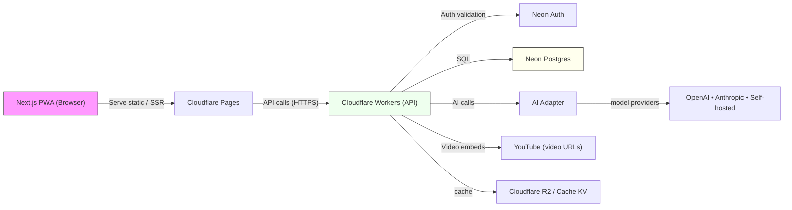
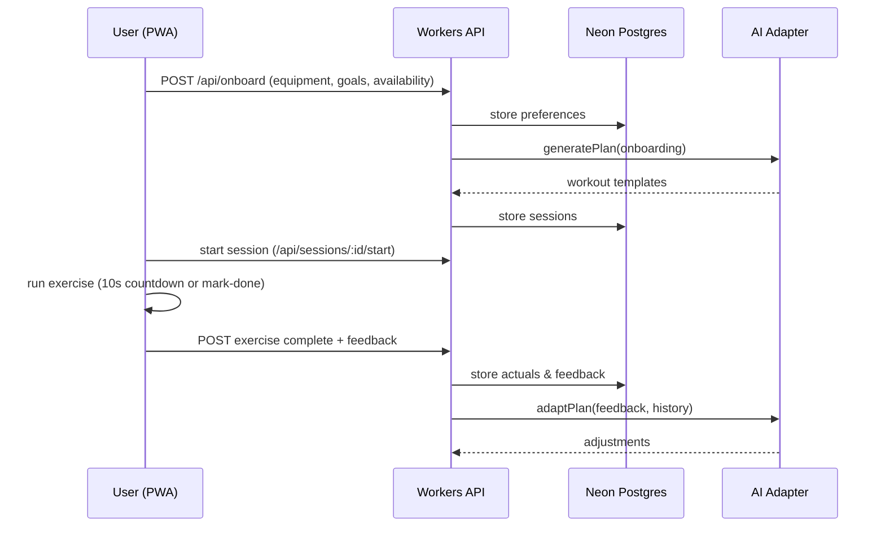

# Technical Overview

This document describes the high-level architecture and session flow for the PWA workout app (Freeletics-style) using Next.js, Cloudflare Workers, Neon Postgres, Neon Auth, YouTube videos, and a model-agnostic AI adapter.

## Overview
- Frontend: Next.js PWA (mobile-first UI) served from Cloudflare Pages.
- API: Cloudflare Workers providing REST endpoints and auth middleware.
- Auth: Neon Auth for user sign-up/sign-in and session tokens.
- DB: Neon Postgres for primary relational storage (users, workouts, sessions, feedback).
- Videos: YouTube embeds; video URLs stored in DB.
- AI: Model-agnostic AI adapter hosted behind Workers; multiple providers supported via adapters.

## Architecture Diagram


## Session Flow (sequence)


## Key data entities (high level)
- `user`: id, email, profile, auth_id, timezone, equipment, availability
- `exercise`: id, name, type (timed|reps), default_target, video_url, tags
- `workout_template`: id, warmup, exercises[], cooldown, difficulty
- `session`: id, user_id, date_scheduled, status, workout_template_id
- `exercise_instance`: session_id, exercise_id, order, target, actual
- `feedback`: session_id, per_exercise, overall_rating

## API surface (selected)
- POST `/api/onboard` — save onboarding preferences
- POST `/api/planner/generate` — request generated sessions
- GET `/api/sessions` — list scheduled sessions
- POST `/api/sessions/:id/postpone` — postpone session
- POST `/api/sessions/:id/start` — mark started
- POST `/api/sessions/:id/exercises/:eid/complete` — record exercise completion
- POST `/api/sessions/:id/finish` — submit overall feedback
- GET `/api/progress` — aggregated metrics for charts

## AI Adapter design (pluggable)
- Implement an `AIAdapter` interface with methods like `generatePlan(onboarding)` and `adaptPlan(feedback, history)`.
- Keep prompts, temperature, provider keys, and rate-limits configurable via Worker environment variables.
- Start with simple rule-based fallback if external model unavailable.

## Notes / Next steps
- Produce a detailed DB schema (SQL migrations) and an OpenAPI spec for endpoints.
- Scaffold a minimal Next.js + Workers repo with Neon Auth wiring and a stub AI adapter.
# Technical Overview

This document describes the high-level architecture and session flow for the PWA workout app (Freeletics-style) using Next.js, Cloudflare Workers, Neon Postgres, Neon Auth, YouTube videos, and a model-agnostic AI adapter.

## Overview
- Frontend: Next.js PWA (mobile-first UI) served from Cloudflare Pages.
- API: Cloudflare Workers providing REST endpoints and auth middleware.
- Auth: Neon Auth for user sign-up/sign-in and session tokens.
- DB: Neon Postgres for primary relational storage (users, workouts, sessions, feedback).
- Videos: YouTube embeds; video URLs stored in DB.
- AI: Model-agnostic AI adapter hosted behind Workers; multiple providers supported via adapters.

## Architecture Diagram
```mermaid
graph LR
  Browser[Next.js PWA (Browser)] -->|Serve static / SSR| Pages[Cloudflare Pages]
  Pages -->|API calls (HTTPS)| Workers[Cloudflare Workers (API)]
  Workers -->|Auth validation| NeonAuth[Neon Auth]
  Workers -->|SQL| NeonDB[Neon Postgres]
  Workers -->|AI calls| AIAdapter[AI Adapter]
  AIAdapter --> ModelProviders[(OpenAI / Anthropic / Self-hosted)]
  Workers -->|Video embeds| YouTube[YouTube (video URLs)]
  Workers -->|cache| R2[Cloudflare R2 / Cache KV]
  style Browser fill:#f9f,stroke:#333,stroke-width:1px
  style Workers fill:#efe,stroke:#333,stroke-width:1px
  style NeonDB fill:#ffe,stroke:#333,stroke-width:1px
```

## Session Flow (sequence)


## Key data entities (high level)
- `user`: id, email, profile, auth_id, timezone, equipment, availability
- `exercise`: id, name, type (timed|reps), default_target, video_url, tags
- `workout_template`: id, warmup, exercises[], cooldown, difficulty
- `session`: id, user_id, date_scheduled, status, workout_template_id
- `exercise_instance`: session_id, exercise_id, order, target, actual
- `feedback`: session_id, per_exercise, overall_rating

## API surface (selected)
- POST `/api/onboard` — save onboarding preferences
- POST `/api/planner/generate` — request generated sessions
- GET `/api/sessions` — list scheduled sessions
- POST `/api/sessions/:id/postpone` — postpone session
- POST `/api/sessions/:id/start` — mark started
- POST `/api/sessions/:id/exercises/:eid/complete` — record exercise completion
- POST `/api/sessions/:id/finish` — submit overall feedback
- GET `/api/progress` — aggregated metrics for charts

## AI Adapter design (pluggable)
- Implement an `AIAdapter` interface with methods like `generatePlan(onboarding)` and `adaptPlan(feedback, history)`.
- Keep prompts, temperature, provider keys, and rate-limits configurable via Worker environment variables.
- Start with simple rule-based fallback if external model unavailable.

## Notes / Next steps
- Produce a detailed DB schema (SQL migrations) and an OpenAPI spec for endpoints.
- Scaffold a minimal Next.js + Workers repo with Neon Auth wiring and a stub AI adapter.
